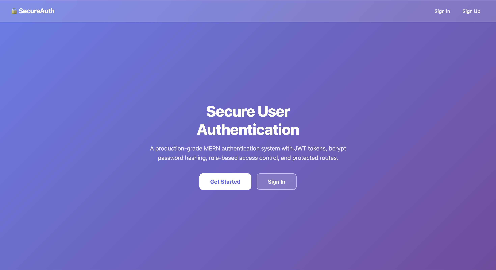
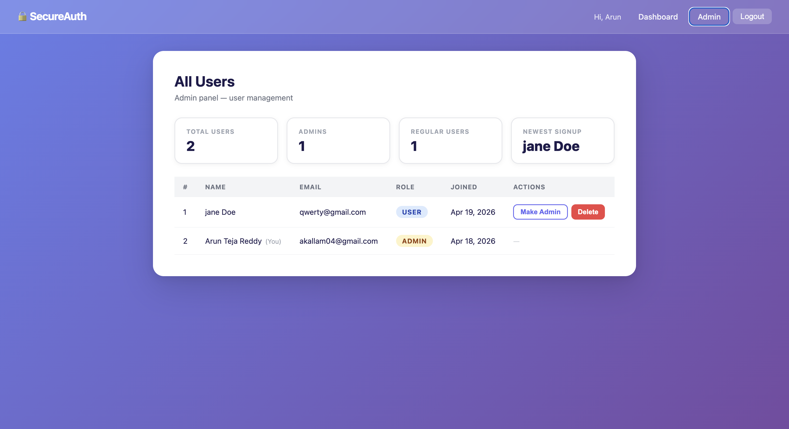

# Secure User Authentication — PRODIGY_FS_01

A production-grade MERN-stack authentication and user management portal built for the Prodigy InfoTech Full-Stack Development Internship, Task 01.

---

## Overview

Implements a complete user authentication system with registration, login, JWT-based session management, protected routes, and role-based access control (RBAC). Includes a full account management portal with profile editing, password changes, and an admin panel for user administration.

---

## Screenshots





---

## Features

**Authentication and Security**
- Email and password registration with format validation and uniqueness checks
- Secure login backed by bcrypt password hashing (10 salt rounds)
- JWT-based sessions with configurable expiry (default 30 days)
- Protected routes — unauthenticated users are redirected to login
- Rate limiting on auth endpoints (20 requests per 15 minutes per IP)
- Session persistence via localStorage with axios Authorization header injection
- Token verification on app mount — invalid or expired sessions are cleared automatically

**Account Management**
- Edit name and email with live server-side uniqueness validation
- Change password with current-password verification before update
- Member-since date and account age computed from the user's creation timestamp

**Role-Based Access Control**
- Two roles: user and admin
- Admin-only routes protected on both the frontend (route guards) and backend (middleware)
- Non-admins are redirected away from admin pages

**Admin Panel**
- Live stats: total users, admin count, regular user count, newest signup name
- Role toggle — promote a user to admin or demote an admin to user
- User deletion behind a confirmation modal
- Self-protection — admins cannot demote or delete their own account, enforced on both client and server

---

## Tech Stack

**Frontend:** React 18, React Router v6, Context API, Axios, React Toastify

**Backend:** Node.js, Express, MongoDB Atlas (Mongoose), jsonwebtoken, bcryptjs, express-rate-limit, dotenv

---

## Project Structure

```
PRODIGY_FS_01/
├── backend/
│   ├── config/
│   │   └── db.js                  # MongoDB connection
│   ├── middleware/
│   │   └── auth.js                # protect and admin middlewares
│   ├── models/
│   │   └── User.js                # User schema with bcrypt pre-save hook
│   ├── routes/
│   │   ├── authRoutes.js          # register, login, me, profile, password
│   │   └── userRoutes.js          # dashboard, list, stats, role, delete
│   ├── .env.example
│   ├── package.json
│   └── server.js
└── frontend/
    ├── public/
    │   └── index.html
    └── src/
        ├── Components/
        │   ├── ChangePasswordModal.js
        │   ├── ConfirmModal.js
        │   ├── EditProfileModal.js
        │   ├── Modal.js
        │   ├── Navbar.js
        │   └── PrivateRoute.js
        ├── context/
        │   └── AuthContext.js
        ├── pages/
        │   ├── AdminUsers.js
        │   ├── Dashboard.js
        │   ├── Home.js
        │   ├── Login.js
        │   └── Register.js
        ├── App.js
        ├── index.css
        └── index.js
```

---

## Getting Started

### Prerequisites

- Node.js v18 or later
- MongoDB Atlas account or a local MongoDB instance

### Installation

```bash
git clone https://github.com/akallam04/PRODIGY_FS_01.git
cd PRODIGY_FS_01
```

**Backend**

```bash
cd backend
npm install
cp .env.example .env    # fill in your values
npm run dev             # http://localhost:5050
```

**Frontend** (new terminal)

```bash
cd frontend
npm install
npm start               # http://localhost:3000
```

The frontend proxies all `/api` requests to `http://localhost:5050`, so both must be running.

---

## Environment Variables

Create `backend/.env` from `backend/.env.example`:

```
PORT=5050
MONGO_URI=mongodb+srv://<user>:<password>@<cluster>.mongodb.net/prodigy_fs_01
JWT_SECRET=<long random string>
JWT_EXPIRE=30d
```

Generate a secure secret:

```bash
node -e "console.log(require('crypto').randomBytes(64).toString('hex'))"
```

---

## API Reference

| Method | Endpoint | Access | Description |
|--------|----------|--------|-------------|
| POST | /api/auth/register | Public | Register a new user; returns JWT |
| POST | /api/auth/login | Public | Authenticate and return JWT |
| GET | /api/auth/me | Private | Fetch current user from token |
| PUT | /api/auth/profile | Private | Update name or email |
| PUT | /api/auth/password | Private | Change password (requires current) |
| GET | /api/users/dashboard | Private | Dashboard greeting and user data |
| GET | /api/users | Admin | List all users |
| GET | /api/users/stats | Admin | Counts and newest signups |
| PUT | /api/users/:id/role | Admin | Promote or demote a user |
| DELETE | /api/users/:id | Admin | Delete a user |

All `/api/auth` routes are rate-limited to 20 requests per 15 minutes per IP.

---

## Design Notes

- JWT over sessions — stateless, horizontally scalable, no server-side session store required
- `password` field has `select: false` on the Mongoose schema — passwords never leave the database unless explicitly requested
- `/api/users/stats` is declared before `/:id` in the router so Express does not treat the string "stats" as a user ID
- `AuthContext` verifies the stored token on mount via `/api/auth/me`, catching expired tokens without requiring a manual logout

---

## Author

**Arun Teja Reddy Kallam**

- LinkedIn: [akallam3](https://linkedin.com/in/akallam3)
- Portfolio: [arunkallam.vercel.app](https://arunkallam.vercel.app)

---

## License

MIT — built as part of the Prodigy InfoTech Internship Program (Task 01).
